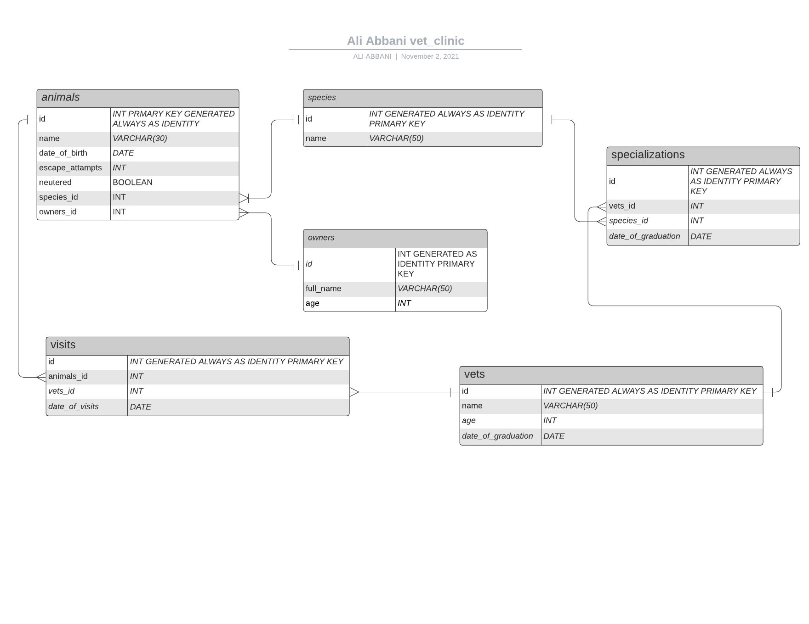

# Vet clinic database

> This template should be used for database related projects at Microverse.
> Generate your own repository, update this README and edit all files content while working on projects. You should not be adding any new files unless asked otherwise.

## Diagram

This project is about using a relational database to create the data structure for a vet clinic. Starting with one table, and step by step will create a complete database with data about:

- animals
- animals' owners
- clinic employees
- visits
- Apart from building data structure, it will be challenge with tasks that require SQL queries to answer specific questions.

## Getting Started

This repository includes files with plain SQL that can be used to recreate a database:

- Use [schema.sql](./schema.sql) to create all tables.
- Use [data.sql](./data.sql) to populate tables with sample data.
- Check [queries.sql](./queries.sql) for examples of queries that can be run on a newly created database. **Important note: this file might include queries that make changes in the database (e.g., remove records). Use them responsibly!**

## Authors

👤 **Ali Abbani**

## Ali's Profile

- [GitHub](https://github.com/aliabbani)
- [AngelList](https://angel.co/u/ali-abbani)
- [LinkedIn](https://www.linkedin.com/in/ali-abbani-8b6246150/)
## 🤝 Contributing

Contributions, issues, and feature requests are welcome!

Feel free to check the [issues page]([../../issues/](https://github.com/aliabbani/Vet-clinic-database/issues)).

## Show your support

Give a ⭐️ if you like this project!

## Acknowledgments

- Hat tip to anyone whose code was used
- Inspiration
- etc

## 📝 License

This project is [MIT](./MIT.md) licensed.
